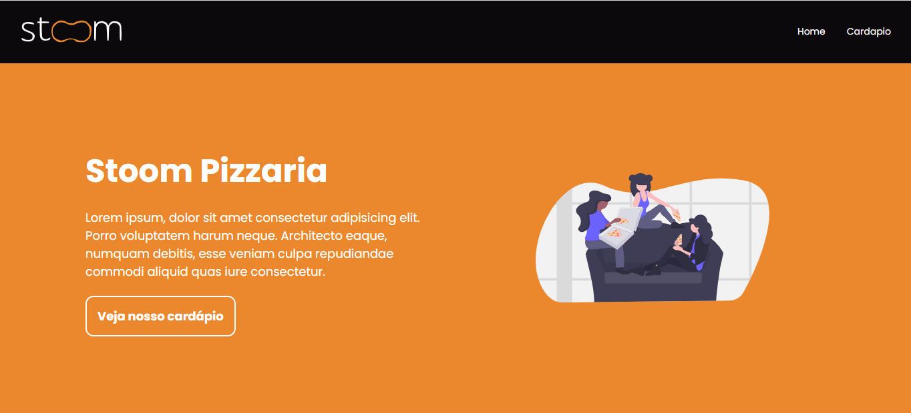

<h1 align="center">
    
</h1>

<h3 align="center">
  Stoom Pizzaria
</h3>

<p align="center">
  <a href="https://www.linkedin.com/in/agra-luca/"></a>
  
  <a href="https://github.com/agraluca/happy_back/commits/main"></a>
  
</p>

<p align="center">
  <a href="#-sobre-o-projeto">Sobre</a>&nbsp;&nbsp;&nbsp;|&nbsp;&nbsp;&nbsp;
  <a href="#-tecnologias">Tecnologias</a>&nbsp;&nbsp;&nbsp;|&nbsp;&nbsp;&nbsp;
  <a href="#-começando">Começando</a>&nbsp;&nbsp;&nbsp;|&nbsp;&nbsp;&nbsp;
  <a href="#-licença">Licença</a>
</p>

<p align="center">
  
</p>

## :bulb: Sobre o projeto

Esse projeto foi desenvolvido como desafio prático para a empresa [Stoom](https://stoom.com.br/) 🚀

Stoom Pizzaria é uma aplicação que simula um site de pedido de delivery para Pizzaria.

Nesse projeto decidi utilizar TypeScript juntamente com Redux - coisa que nunca havia feito antes. Foi uma experiência desafiadora mas muita boa. Tive algumas dificuldades com a tipagem do redux, mas no geral me virei. Decidi não utilizar bibliotecas de componente como Antd e Material UI para conseguir mostrar minhas habilidades com o CSS - nessa caso utilizei o Styled components. 

Como API, utilizei o [Mock API](https://mockapi.io/), que me permitiu criar apenas 4 endpoints. Eu acabei precisando de 5 no total, mas como o plano gratuito so permitia 4 endpoints, utilizei também o local storage do navegador, mostrando também saber utilizar essa ferrmanta.

Montei uma estrutura de projeto pensada a longo prazo, usando prettier, eslint e uma arquitetura bem dividida com os Ducks no Redux. Além disso criei um tema para o projeto, tornando o desenvlvimento mais prazeroso - visto que o TypeScript auxilia na tipagem ao acessar uma propriedade - e evitando problemas de alterações de cores, espaçamento e etc no futuro, bastando apenas alterar em um lugar. 

Por fim, como a logo da Stoom não estava de fácil acesso pela internet, decidi vetorizar usando o Figma para ter a logo em SVG, mantendo a qualidade e possibilitando alterações de cores.

O link da aplicação no ar será: 
[Stoom Pizzaria](https://stoom-pizzaria.netlify.app/)

## 🚀 Tecnologias

Technologias que eu utilizei desenvolvendo essa aplicação:

- [ReactJS](https://reactjs.org/)
- [TypeScript](https://www.typescriptlang.org/)
- [Redux Toolkit](https://redux-toolkit.js.org/)
- [Axios](https://github.com/axios/axios)
- [React Router DOM](https://reacttraining.com/react-router/)
- [Styled Component](https://styled-components.com/)
- [Testing Library](https://testing-library.com/)


## 💻 Começando
Para começar precisamos instalar algumas coisas

### Requerimentos

- [Node.js](https://nodejs.org/en/)
- [Yarn](https://classic.yarnpkg.com/)


```bash
$ git clonehttps://github.com/agraluca/stoom-pizzaria.git && cd stoom-pizzaria
```

**Siga esses passos**

### Web

```bash

# Instale as dependências
$ yarn


# Rodando o cliente
$ yarn start
```


## 📝 Licença

Esse projeto é licenciado pelo MIT License - veja o arquivo [LICENSE](LICENSE) para mais detalhes.

---

Feito com amor 💙&nbsp; por Luca Agra 👋 &nbsp;[Veja meu linkedin](https://www.linkedin.com/in/agra-luca/)
